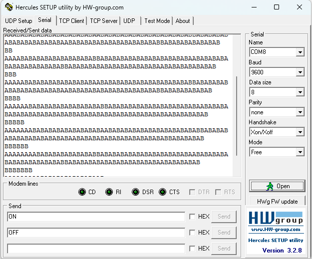

# FreeRTOS STM32F103 - Bài 13.2: Truy cập tài nguyên dùng chung không có Mutex (UART STM32)

## Giới thiệu

Chương trình này minh họa vấn đề **tranh chấp tài nguyên (resource conflict)** trong **FreeRTOS** khi **hai task cùng truy cập UART (USART1)** mà **không sử dụng cơ chế bảo vệ như Mutex hoặc Semaphore.**

Mục tiêu:
- Có **2 Task** hoạt động song song:
  1. `Task01_Funct` – Gửi chuỗi ký tự 'A' liên tục qua UART.
  2. `Task02_Funct` – Gửi chuỗi ký tự 'A' liên tục qua UART.

---

## Vấn đề gặp phải
Do **UART là tài nguyên dùng chung**, việc **hai task cùng gửi dữ liệu mà không đồng bộ** dẫn đến:
 - Chuỗi ký tự bị xen lẫn giữa hai task (ví dụ: AAAABBAAABBBBBB...),
 - Dữ liệu gửi ra **mất tính toàn vẹn** (data corruption).
 - Có thể gây lỗi hệ thống khi buffer tuyền bị **ghi đè hoặc tràn dữ liệu**.

## Phân tích hoạt động
1. **Hai Task** được tạo trong `main()` có cùng mức ưu tiên bằng 1, nên FreeRTOS sẽ luân phiên chuyển đổi giữa chúng sau mỗi lần gọi `vTaskDelay(100)`.
2. Cả 2 đều gọi hàm `uart_SendStr()` để gửi từng byte qua USART1, Vì không có mutex bảo vệ UART, nếu Task01 đang gửi giữa chừng và Task02 được chuyển ngữ cảnh, thì Task02 sẽ ghi đè vào thanh ghi truyền USART khiển chuỗi bị xen lẫn hoặc lỗi.

## Hình ảnh mô tả

