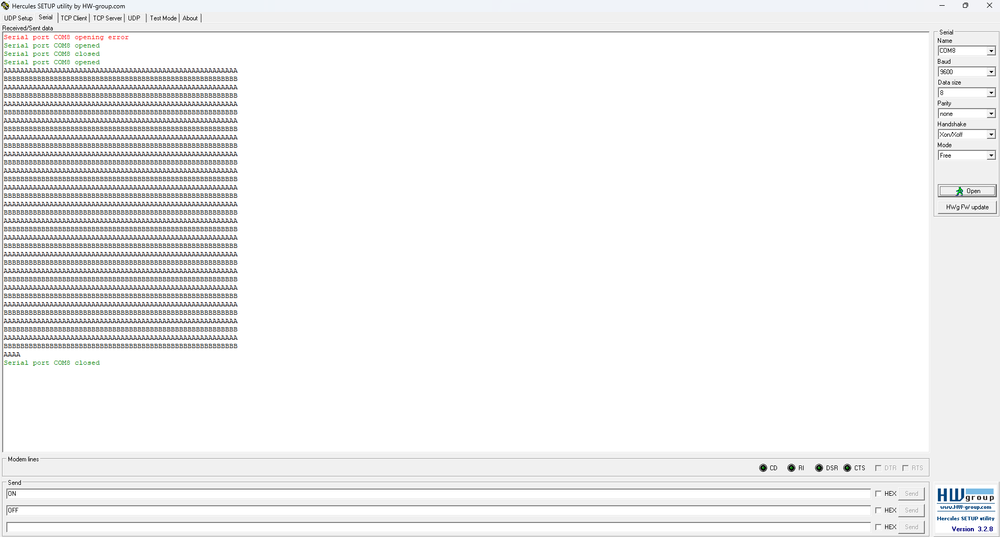

# STM32 FreeRTOS – Bài 13.3: Bảo vệ tài nguyên dùng chung với Mutex

## Giới thiệu
Dự án này minh họa việc **sử dụng cơ chế Mutex (Mutual Exclusion Semaphore)** trong FreeRTOS để **bảo vệ tài nguyên dùng chung – UART1** trên vi điều khiển **STM32F103C8T6**.

Nếu không sử dụng Mutex, khi **hai task cùng truy cập UART** (ví dụ: gửi chuỗi ký tự) thì dữ liệu gửi ra cổng UART có thể bị **xen kẽ hoặc lỗi định dạng**.  
Ở ví dụ này, Mutex giúp đảm bảo **chỉ một task được phép truy cập UART tại một thời điểm**.

---

## Cấu trúc chương trình

### 1. Tạo Mutex
```c
Mutex01 = xSemaphoreCreateMutex();
```
Dùng để tạo một Mutex (dạng nhị phân) phục vụ việc bảo vệ tài nguyên dùng chung.

### 2. Tạo hai task cùng truy cập UART
```c
xTaskCreate(Task01_Funct, "Task01", 128, NULL, 1, NULL);
xTaskCreate(Task02_Funct, "Task02", 128, NULL, 1, NULL);
```
- **Task01** gửi chuỗi ký tự `'A'` qua UART.
- **Task02** gửi chuỗi ký tự `'B'` qua UART.

### 3. Cơ chế bảo vệ tài nguyên
Trong mỗi Task:
```c
if (xSemaphoreTake(Mutex01, portMAX_DELAY) == pdTRUE) {
    uart_SendStr("AAAA....");
    xSemaphoreGive(Mutex01);
}
```
**Giải thích:**
- `xSemaphoreTake()` yêu cầu quyền truy cập UART.
- Nếu UART đang bận, task sẽ chờ đến khi Mutex được giải phóng.
- Sau khi hoàn tất, `xSemaphoreGive`, giải phóng Mutex cho Task khác.

## Hình ảnh mô tả
