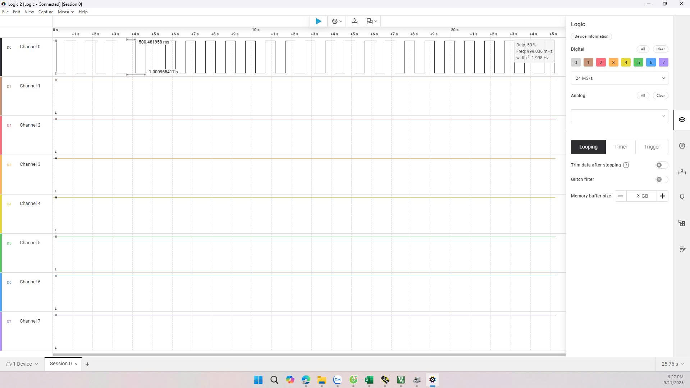

# MÔN HỆ THỐNG NHÚNG - Bài 4.1: Cấu hình Timer ở chế độ cơ bản, sử dụng Timer để tạo hàm Delay có độ chính xác cao.

## Giới thiệu:

Đây là ví dụ cơ bản dùng **STM32F103C8T6** để điều khiển LED nhấp nháy.  
Thay vì sử dụng `HAL_Delay` hoặc vòng lặp rỗng, chương trình này sử dụng **Timer 2 (TIM2)** để tạo hàm **Delay chính xác theo mili-giây**.

---

## Các bước thực hiện:
### 1. Cấu hình chân GPIO.
```c
void Config_Led(){
	GPIO_InitTypeDef led;
	RCC_APB2PeriphClockCmd(RCC_APB2Periph_GPIOA, ENABLE);
	led.GPIO_Mode			= GPIO_Mode_Out_PP;
	led.GPIO_Pin			= GPIO_Pin_0;
	led.GPIO_Speed			= GPIO_Speed_50MHz;
	GPIO_Init(GPIOA, &led);
}
```
- Cấu hình PA0 để điều khiển led.
  
### 2. Cấu hình Timer.
```c
void Config_Timer(){
	TIM_TimeBaseInitTypeDef timer;
	RCC_APB1PeriphClockCmd(RCC_APB1Periph_TIM2, ENABLE);
	timer.TIM_ClockDivision			= 0;
	timer.TIM_CounterMode			= TIM_CounterMode_Up;
	timer.TIM_Period				= 65535;
	timer.TIM_Prescaler				= 72 - 1;
	timer.TIM_RepetitionCounter		= 0;
	TIM_TimeBaseInit(TIM2, &timer);
}
```
- Kích hoạt clock cho TIM2.  
- Thiết lập bộ chia tần số (`Prescaler = 72 - 1`) để tạo xung clock 1 MHz (1 tick = 1 µs).  
- Thiết lập `Period = 65535` (max 16-bit counter).  
- Bộ đếm chạy **chế độ lên (Upcounter)**. 

 ### 3. Hàm Delay_1ms().
 ```c
 void Delay_1ms(){
	TIM_Cmd(TIM2, ENABLE);
	TIM_SetCounter(TIM2, 0);
	while(TIM_GetCounter(TIM2) < 1000);
	TIM_Cmd(TIM2, DISABLE);
}
```
- Bật TIM2.  
- Reset Counter về 0.  
- Chờ đến khi Counter đạt 1000 (tương ứng 1000 µs = 1 ms).  
- Dừng TIM2.  

### 4. Hàm Delay_ms(t).
```c
void Delay_ms(unsigned int t){
	while(t--){
		Delay_1ms();
	}
}
```
- Lặp lại `Delay_1ms()` **t lần** để tạo khoảng trễ t ms.
### 5. Hàm main().
```c
int main(){
	Config_Led();
	Config_Timer();
	while(1){
		GPIO_WriteBit(GPIOA, GPIO_Pin_0, 0);
		Delay_ms(500);
		GPIO_WriteBit(GPIOA, GPIO_Pin_0, 1);
		Delay_ms(500);
	}
}
```
- Cấu hình LED và Timer.  
- Trong vòng lặp vô hạn:  
  - Bật LED → Delay 500 ms.  
  - Tắt LED → Delay 500 ms.  
- Kết quả: LED nhấp nháy với chu kỳ 1 giây (0.5s sáng, 0.5s tắt).  

---
## Hình ảnh mô phỏng trên Logic Analyzer



## Video Mô Phỏng:
> https://youtube.com/shorts/UtYWEgx-k1g?feature=share


