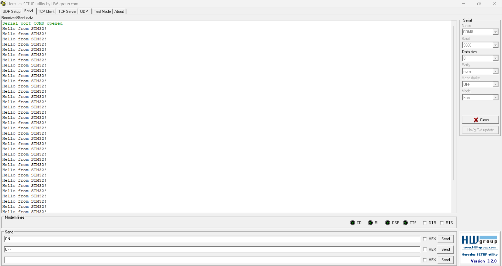
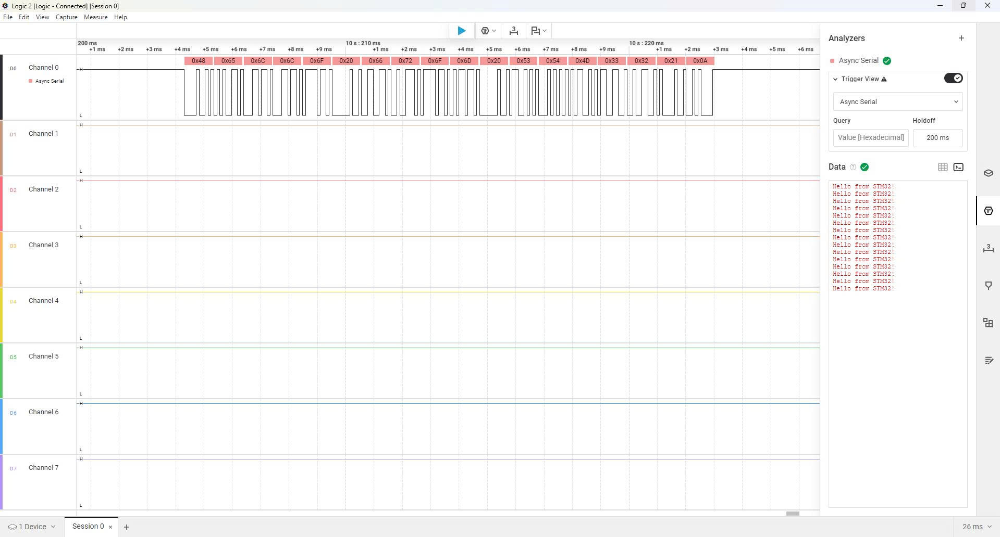

# MÔN HỆ THỐNG NHÚNG - Bài 5.1: Cấu hình UART trên STM32F1. Viết chương trình gửi chuỗi "Hello from STM32!" tới máy tính. Sử dụng phần mềm terminal để hiện thị chuỗi này.

## Giới thiệu:

Đây là ví dụ cơ bản dùng **STM32F103C8T6** để gửi dữ liệu qua UART.  
Chương trình sẽ gửi chuỗi `"Hello from STM32!"` liên tục đến máy tính hoặc thiết bị nhận UART.  
Chúng ta sử dụng **GPIO và USART1** mà không dùng HAL, chỉ dùng **Standard Peripheral Library**.

---

## Các bước thực hiện:

### 1. Cấu hình chân GPIO.
```c
void Config_GPIO(){
    GPIO_InitTypeDef uart;
    RCC_APB2PeriphClockCmd(RCC_APB2Periph_GPIOA, ENABLE);

    // TX (PA9)
    uart.GPIO_Mode  = GPIO_Mode_AF_PP;
    uart.GPIO_Pin   = GPIO_Pin_9;
    uart.GPIO_Speed = GPIO_Speed_50MHz;
    GPIO_Init(GPIOA, &uart);

    // RX (PA10)
    uart.GPIO_Mode  = GPIO_Mode_IN_FLOATING;
    uart.GPIO_Pin   = GPIO_Pin_10;
    GPIO_Init(GPIOA, &uart);
}
```
- Cấu hình PA9 làm TX (truyền dữ liệu) kiểu Push-Pull.
- Cấu hình PA10 làm RX (nhận dữ liệu) kiểu Floating Input.

### 2. Cấu hình UART1.
```c
void Config_Uart(){
    USART_InitTypeDef usart;
    RCC_APB2PeriphClockCmd(RCC_APB2Periph_USART1, ENABLE);

    usart.USART_BaudRate            = 9600;
    usart.USART_HardwareFlowControl = USART_HardwareFlowControl_None;
    usart.USART_Mode                = USART_Mode_Tx;
    usart.USART_Parity              = USART_Parity_No;
    usart.USART_StopBits            = USART_StopBits_1;
    usart.USART_WordLength          = USART_WordLength_8b;

    USART_Init(USART1, &usart);
    USART_Cmd(USART1, ENABLE);
}
```
- Kích hoạt clock cho USART1.
- Thiết lập baudrate 9600, 8 bit dữ liệu, không parity, 1 stop bit.
- Chỉ sử dụng chế độ truyền dữ liệu (TX).
  
### 3. Hàm gửi ký tự và chuỗi qua UART.
```c
void uart_SendChar(char c){
    USART_SendData(USART1, c);
    while(USART_GetFlagStatus(USART1, USART_FLAG_TXE) == RESET);
}

void uart_SendStr(char *str){
    while(*str != '\0'){
        uart_SendChar(*str++);
    }
}
```
- `uart_SendChar()`: gửi từng ký tự và chờ TX buffer sẵn sàng.
- `uart_SendStr()`: gửi toàn bộ chuỗi kết thúc bằng `\0`.

### 4. Hàm Delay đơn giản.
```c
void Delay_ms(unsigned int t){
    unsigned int i, j;
    for(i = 0; i < t; i++){
        for(j = 0; j < 0x2aff; j++);
    }
}
```
- Tạo khoảng trễ xấp xỉ t ms bằng vòng lặp rỗng.

### 5. Hàm main().
```c
int main(){
    Config_GPIO();
    Config_Uart();
    while(1){
        uart_SendStr("Hello from STM32!\n");
        Delay_ms(500);
    }
}
```
- Cấu hình GPIO và UART.
- Trong vòng lặp vô hạn: gửi chuỗi "Hello from STM32!" mỗi 500ms.

---
### Kết quả quan sát
- Mở phần mềm hercules để quan sát chuỗi được gửi từ STM32F1 lên máy tính.
- Chọn cổng COM, baud, Datasize, parity theo cấu hình trên.




### Kết quả quan sát trên logic analyzer

---
### Video mô phỏng
>https://youtube.com/shorts/Brip_Tq3fU8?feature=share
