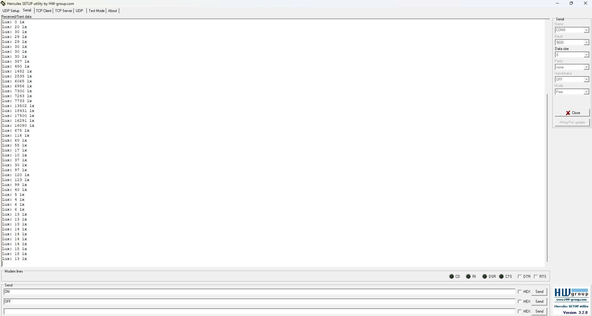

# MÔN HỆ THỐNG NHÚNG - Bài 6: Đọc ánh sáng từ cảm biến BH1750 qua I2C và hiển thị trên máy tính qua UART

## Giới thiệu:

Ví dụ này sử dụng **STM32F103C8T6** để đọc dữ liệu ánh sáng từ cảm biến **BH1750** qua giao tiếp **I2C** và gửi giá trị đo được tới máy tính qua **UART1**.  
Chương trình sử dụng **Standard Peripheral Library (SPL)** và hiển thị giá trị lux trên terminal bằng phần mềm Hercules.

---

## Các bước thực hiện:

### 1. Cấu hình UART1

```c
void Config_USART(){
    GPIO_InitTypeDef gpio;
    USART_InitTypeDef usart;

    RCC_APB2PeriphClockCmd(RCC_APB2Periph_GPIOA | RCC_APB2Periph_USART1, ENABLE);

    // TX (PA9)
    gpio.GPIO_Mode  = GPIO_Mode_AF_PP;
    gpio.GPIO_Pin   = GPIO_Pin_9;
    gpio.GPIO_Speed = GPIO_Speed_50MHz;
    GPIO_Init(GPIOA, &gpio);

    // RX (PA10)
    gpio.GPIO_Mode  = GPIO_Mode_IN_FLOATING;
    gpio.GPIO_Pin   = GPIO_Pin_10;
    GPIO_Init(GPIOA, &gpio);

    usart.USART_BaudRate            = 9600;
    usart.USART_HardwareFlowControl = USART_HardwareFlowControl_None;
    usart.USART_Mode                = USART_Mode_Rx | USART_Mode_Tx;
    usart.USART_Parity              = USART_Parity_No;
    usart.USART_StopBits            = USART_StopBits_1;
    usart.USART_WordLength          = USART_WordLength_8b;

    USART_Init(USART1, &usart);
    USART_Cmd(USART1, ENABLE);
}
```
- PA9 là TX, PA10 là RX.
- Baudrate 9600, 8 bit dữ liệu, 1 bit stop, không parity.
- Cho phép truyền và nhận dữ liệu.
  
### 2. Cấu hình I2C1.
```c
void Config_I2C(){
    GPIO_InitTypeDef gpio_i2c;
    I2C_InitTypeDef i2c;

    RCC_APB2PeriphClockCmd(RCC_APB2Periph_GPIOB, ENABLE);
    RCC_APB1PeriphClockCmd(RCC_APB1Periph_I2C1, ENABLE);

    // PB6-SCL; PB7-SDA
    gpio_i2c.GPIO_Mode  = GPIO_Mode_AF_OD;
    gpio_i2c.GPIO_Pin   = GPIO_Pin_6 | GPIO_Pin_7;
    gpio_i2c.GPIO_Speed = GPIO_Speed_50MHz;
    GPIO_Init(GPIOB, &gpio_i2c);

    i2c.I2C_Ack                     = I2C_Ack_Enable;
    i2c.I2C_AcknowledgedAddress     = I2C_AcknowledgedAddress_7bit;
    i2c.I2C_ClockSpeed              = 100000; // 100 kHz chuẩn
    i2c.I2C_DutyCycle               = I2C_DutyCycle_2;
    i2c.I2C_Mode                     = I2C_Mode_I2C;
    i2c.I2C_OwnAddress1             = 0x00;

    I2C_Init(I2C1, &i2c);
    I2C_Cmd(I2C1, ENABLE);
}
```
- PB6 là SCL, PB7 là SDA.
- Chế độ 7-bit address, chuẩn 100kHz, bật ACK.
- Dùng I2C1 làm master để giao tiếp BH1750.

### 3. Khởi tạo BH1750.
```c
void BH1750_Init(void){
    // Power ON
    I2C_GenerateSTART(I2C1, ENABLE);
    while(!I2C_CheckEvent(I2C1, I2C_EVENT_MASTER_MODE_SELECT));
    I2C_Send7bitAddress(I2C1, BH1750_ADDR<<1, I2C_Direction_Transmitter);
    while(!I2C_CheckEvent(I2C1, I2C_EVENT_MASTER_TRANSMITTER_MODE_SELECTED));
    I2C_SendData(I2C1, 0x01); // Power ON
    while(!I2C_CheckEvent(I2C1, I2C_EVENT_MASTER_BYTE_TRANSMITTED));
    I2C_GenerateSTOP(I2C1, ENABLE);

    // Reset
    I2C_GenerateSTART(I2C1, ENABLE);
    while(!I2C_CheckEvent(I2C1, I2C_EVENT_MASTER_MODE_SELECT));
    I2C_Send7bitAddress(I2C1, BH1750_ADDR<<1, I2C_Direction_Transmitter);
    while(!I2C_CheckEvent(I2C1, I2C_EVENT_MASTER_TRANSMITTER_MODE_SELECTED));
    I2C_SendData(I2C1, 0x07); // Reset
    while(!I2C_CheckEvent(I2C1, I2C_EVENT_MASTER_BYTE_TRANSMITTED));
    I2C_GenerateSTOP(I2C1, ENABLE);

    // Continuous H-Resolution Mode
    I2C_GenerateSTART(I2C1, ENABLE);
    while(!I2C_CheckEvent(I2C1, I2C_EVENT_MASTER_MODE_SELECT));
    I2C_Send7bitAddress(I2C1, BH1750_ADDR<<1, I2C_Direction_Transmitter);
    while(!I2C_CheckEvent(I2C1, I2C_EVENT_MASTER_TRANSMITTER_MODE_SELECTED));
    I2C_SendData(I2C1, 0x10);
    while(!I2C_CheckEvent(I2C1, I2C_EVENT_MASTER_BYTE_TRANSMITTED));
    I2C_GenerateSTOP(I2C1, ENABLE);
}
```
- Gửi lệnh Power ON, Reset, và Continuous High-Resolution mode cho BH1750.
- Mỗi lần gửi: START → Address → Data → STOP.
- Chờ event I2C để đảm bảo slave ACK.
### 4. Đọc dữ liệu ánh sáng từ BH1750
```c
uint16_t BH1750_ReadLight(void){
    uint16_t value;
    uint8_t high, low;

    I2C_GenerateSTART(I2C1, ENABLE);
    while(!I2C_CheckEvent(I2C1, I2C_EVENT_MASTER_MODE_SELECT));
    I2C_Send7bitAddress(I2C1, BH1750_ADDR<<1, I2C_Direction_Receiver);
    while(!I2C_CheckEvent(I2C1, I2C_EVENT_MASTER_RECEIVER_MODE_SELECTED));

    while(!I2C_CheckEvent(I2C1, I2C_EVENT_MASTER_BYTE_RECEIVED));
    high = I2C_ReceiveData(I2C1);

    while(!I2C_CheckEvent(I2C1, I2C_EVENT_MASTER_BYTE_RECEIVED));
    low = I2C_ReceiveData(I2C1);

    I2C_AcknowledgeConfig(I2C1, DISABLE);
    I2C_GenerateSTOP(I2C1, ENABLE);
    I2C_AcknowledgeConfig(I2C1, ENABLE);  

    value = (high<<8) | low;
    return (uint16_t)(value / 1.2); // Chuyển sang lux
}
```
- Đọc 2 byte từ BH1750: byte cao và byte thấp.
- Kết hợp thành giá trị 16-bit và chia 1.2 để ra lux theo datasheet.

### 5. Hàm main.
```c
int main(){
    Config_USART();
    Config_I2C();
    BH1750_Init();
    while(1){
        uint16_t lux = BH1750_ReadLight();
        printf("Lux: %u lx\r\n", lux);
        Delay_ms(500);
    }
}
```
- Cấu hình UART và I2C.
- Khởi tạo BH1750.
- Vòng lặp vô hạn: đọc giá trị ánh sáng và gửi qua UART mỗi 500 ms.

---
### Kết quả quan sát
- Mở phần mềm hercules để quan sát chuỗi được gửi từ STM32F1 lên máy tính.
- Chọn cổng COM, baud, Datasize, parity theo cấu hình trên.



---
### Video mô phỏng
>https://youtube.com/shorts/kycnrYnmdkI?feature=share

 